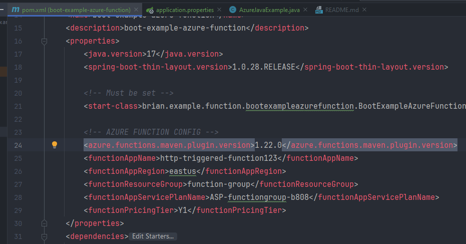

For typical Azure Function example go [here](https://github.com/allthatjava/azure-function-example-in-java).
This is Spring Boot example for Azure Function.

### To run the code
Enter the proper values in the following properties

`<start-class>` is crucial properties to have. If you don't set it, Azure Function service will not know the Main Class and fail to start the function  

* For deployment to Azure, following plugin is essential
```xml
           <plugin>
                <groupId>com.microsoft.azure</groupId>
                <artifactId>azure-functions-maven-plugin</artifactId>
                <version>${azure.functions.maven.plugin.version}</version>

                <configuration>
            ...
                </configuration>
           </plugin>
```
* Also, requires host.json file and local.settings.json file in /src/main/resources directory

### To deploy to Azure
first run the maven package command
`mvn clean package`
then deploy with maven-azure command
`mvn azure-functions:deploy`

It will bring up OAuth login screen. Login with Microsoft Login ID.
Then select subscription if you have more than 1 subscription on Azure.
Then it will show the message that deployment is completed and show the functions link.
